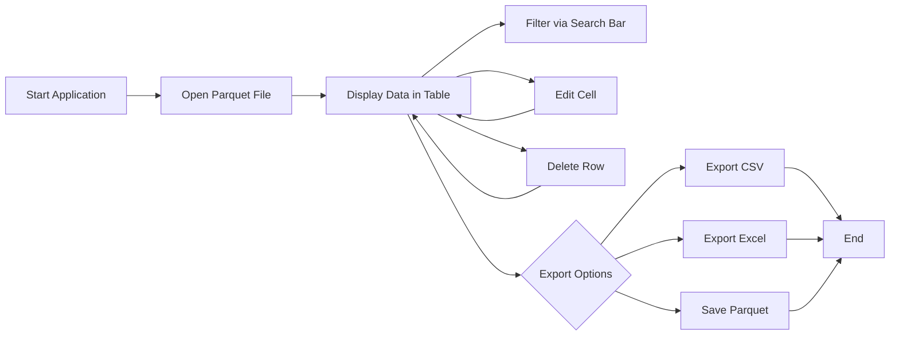

# csv2parquet

Convert large CSV files to Parquet reliably, verify parity, and visualize results.  
The GUI streams CSV in chunks to keep memory usage bounded, writes Parquet with `pyarrow`, validates row counts and schema, and produces two plots:

- Size comparison (CSV vs Parquet)
- 4x4 comparison grid (CSV top rows, Parquet bottom rows) for: Voltage, Current, Temperature, SOC

Plots are auto-saved under a `plots/` folder next to the Parquet output.

---

## Features

- Chunked CSV -> Parquet conversion via `ParquetWriter`
- Compression selection (snappy, zstd, gzip, brotli, lz4, none)
- Parity checks:
  - Row count equality
  - Column-order equality
- Size bar chart (CSV vs Parquet)
- 4x4 comparison grid (no overlay), laid out as:
  - Columns: Voltage, Current, Temperature, SOC
  - Rows 0–1: CSV
  - Rows 2–3: Parquet
- Auto-save plots to `plots/`
- Manual Save Current Plot action
- Background thread for conversion with progress bar and logs

---

## Why Parquet Is Better Than CSV for ML Training

Parquet is usually better than CSV for ML training data because it reduces both I/O and CPU overhead while preserving schema integrity. Below are the key advantages:

### 1. Columnar Layout

- Reads only the required columns (e.g., features and label) instead of entire rows.
- Reduces I/O volume and accelerates training epochs.

### 2. Strong Schema and Types

- Maintains data types, nullability, and nested structures.
- Avoids CSV parsing ambiguities like delimiter issues, quoting, locale, and NA tokens.

### 3. Compression and Encoding

- Uses column-wise compression (Snappy, ZSTD, Brotli) and encodings (dictionary, RLE).
- Smaller file size leads to faster downloads and better cache performance.

### 4. Predicate Pushdown and Statistics

- Row-group and column-chunk statistics let engines skip irrelevant chunks.
- Reduces data scanned before reaching the model’s dataloader.

### 5. Vectorized Reads via Arrow

- Enables zero-copy or low-copy reads directly into Arrow memory.
- Faster hand-off to pandas, NumPy, or PyTorch tensors.
- CSV parsing is slower and CPU-intensive due to string handling.

### 6. Consistency and Reproducibility

- Schema stability prevents column-order drift or silent type changes.
- Handles null values correctly, avoiding lossy conversions.

### 7. Distributed and Cloud-Friendly

- Scales seamlessly with partitioned datasets (S3, GCS, Azure).
- Integrates with engines like Spark, Dask, and Polars for distributed reads.
- Supports partition pruning and predicate pushdown for massive datasets.

### Practical Implications for Training

- Faster dataloading: minimal parse overhead.
- Lower memory footprint: selective column loading.
- Better multi-worker throughput: parallel row groups.

### Example: Selective Column Loading

```python
import pandas as pd
df = pd.read_parquet("data/train.parquet", columns=["feature_1", "feature_2", "label"])
````

Equivalent CSV reading would still parse all columns before dropping extras.

### Example: Predicate Pushdown

```python
import pyarrow.dataset as ds
dataset = ds.dataset("s3://bucket/train_parquet/", format="parquet")
table = dataset.to_table(columns=["f1", "f2", "label"],
                         filter=ds.field("split") == "train")
```

### Caveats

- Too many small Parquet files hurt throughput. Use 128–512 MB row groups.
- Appending to Parquet is less convenient; design your write pipeline carefully.
- For log-style or streaming text data, CSV or JSON lines might still fit better.
- For large unstructured data (e.g., images), use binary containers like TFRecord or WebDataset.

**Summary:**
For structured ML data, Parquet yields faster, cheaper, and more consistent training due to columnar I/O, compression, and schema enforcement.

---

## Requirements

- Python 3.9+

Install dependencies:

```bash
pip install -r requirements.txt
```

---

## Run

```bash
python ui.py
```

---

## Usage

1. Click **Browse CSV** and select your `.csv` file.
2. The Parquet output path auto-fills as `<input>.parquet`.
3. Adjust settings:

   - Delimiter, encoding, chunk size, compression, etc.
4. Click **Convert** to start the process.
5. When done:

   - Check the **Parity** panel for validation results.
   - View the **Size Comparison** and **4x4 CSV vs Parquet** plots.
6. All plots are automatically saved to:

   ```sh
   plots/<parquet_basename>_size.png
   plots/<parquet_basename>_compare_4x4.png
   ```

---

## Expected Columns for 4x4 Plot

- `Time`
- `Voltage`
- `Current`
- `Temperature`
- `SOC`

If your time column is numeric, it is treated as seconds. Change the `time_unit` in `_plot_4x4()` to `"ms"` if stored in milliseconds.


# Parquet Viewer

> A simple desktop application for viewing, editing, filtering, and exporting Parquet files.

## What is Parquet?

- [Apache Parquet](https://parquet.apache.org/) is a columnar storage file format designed for efficient data storage and retrieval. 
- Unlike row-based formats (e.g., CSV), Parquet organizes data by column, enabling:
    * **High Compression & Encoding**: Columns often contain homogeneous data that compresses better and supports specialized encodings.
    * **Selective Reads**: Queries can read only the necessary columns, greatly reducing I/O.
    * **Schema Evolution**: Columns can be added or removed without invalidating existing files.
- Parquet is ideal for large-scale analytics, data warehouses, and distributed processing frameworks like Apache Spark, Hadoop, and Dask.

## Features

* **Load Parquet files** (`.parquet`) via a file dialog
* **Search and filter** rows with a live search bar
* **Inline editing** of cell values (double-click to edit)
* **Delete rows** via context menu (right-click)
* **Export** filtered data to CSV, Excel (`.xlsx`), or save back to Parquet

## Requirements

* Python 3.7+
* PySide6
* pandas
* pyarrow (for Parquet read/write)
* openpyxl (for Excel export)

Install dependencies:

```bash
pip install PySide6 pandas pyarrow openpyxl
```

## Usage

```bash
python parquet_viewer.py
```

1. Click **Open** in the menu bar to load a Parquet file.
2. Use the **Search** field to filter rows in real time.
3. **Double-click** any cell to edit its value.
4. **Right-click** a row to delete it.
5. Export your changes:

   * **Export CSV**
   * **Export Excel**
   * **Save Parquet**

## Workflow Diagram



## Project Structure

```text
├── ui.py   # Main application source
├── parser.png          # Custom application icon
├── README.md           # Project documentation
└── requirements.txt    # Dependency list
```
