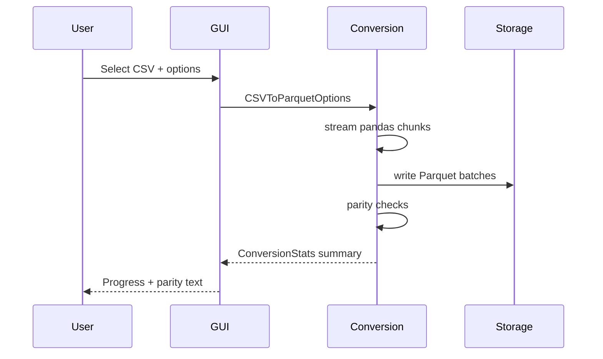
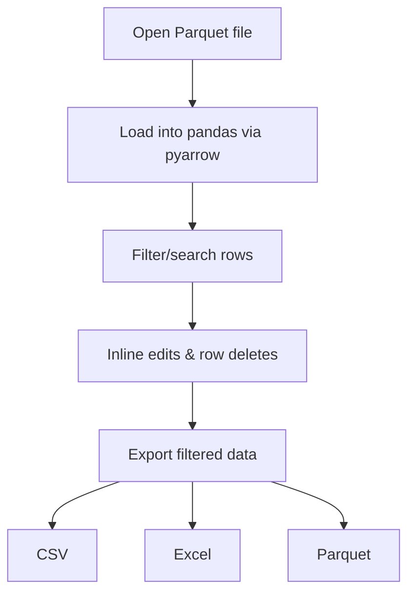

# Parquet App Overview

This document summarizes the architecture and data flows for the Parquet App. The application ships a desktop GUI and CLI around a shared conversion and inspection core.

## Architecture

```mermaid
flowchart LR
    subgraph UI
        GUI[Qt GUI]\nConverter & Viewer
        CLI[CLI commands]
    end

    subgraph Core
        Conversion[conversion.py]\nCSV <-> Parquet <-> JSONL
        Inspection[inspection.py]\nmetadata + previews
        Utils[utils.py]\npaths, sizes
    end

    subgraph Data
        CSV[(CSV files)]
        PQ[(Parquet files)]
        JSONL[(JSON Lines)]
    end

    GUI --> Conversion
    CLI --> Conversion
    CLI --> Inspection
    Conversion --> PQ
    Conversion --> CSV
    Conversion --> JSONL
    Inspection --> PQ
    PQ --> GUI
    CSV <-- Conversion --> JSONL
```

**Key points**
- A single conversion module handles streaming reads/writes for CSV, Parquet, and JSONL.
- The GUI and CLI both call into the same conversion and inspection helpers.
- The viewer operates directly on Parquet files loaded with pyarrow/pandas.

## Converter pipeline



## Viewer workflow



## Supported workflows
- Convert large CSV files to Parquet with streaming writes, compression choice, and parity summaries.
- Convert Parquet files to CSV or JSON Lines with batching and optional column projection.
- Inspect Parquet metadata (schema, row groups, size) and preview data from the CLI.
- View, search, edit, and export Parquet tables from the desktop GUI.

