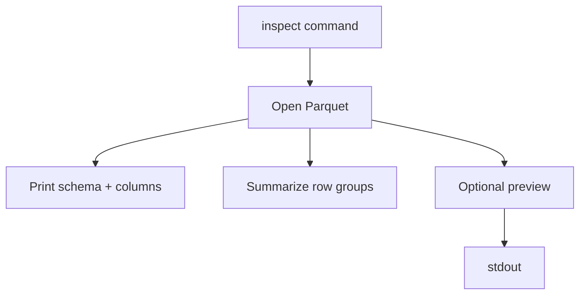

# Usage Guide

This guide walks through common CLI and GUI tasks for the Parquet App.

## Installation

```bash
pip install -r requirements.txt
```

## CLI commands

### Convert files

```bash
python -m parquet_app.cli convert input.csv --compression zstd --chunksize 500000
python -m parquet_app.cli convert data.parquet --jsonl --output data.jsonl
```

- CSV input defaults to Parquet output with the same basename.
- Parquet input defaults to CSV output; add `--jsonl` for JSON Lines.
- Use `--columns col1,col2` to restrict Parquet->text conversions.

### Inspect metadata

```bash
python -m parquet_app.cli inspect example.parquet --preview --limit 10
```

Outputs schema, row groups, size, and optionally a data preview with offset/limit controls.



## Desktop app

Launch the Qt GUI:

```bash
python -m parquet_app.cli gui
```

### Converter tab
- Choose a CSV input and Parquet output path.
- Configure delimiter, encoding, chunk size, compression, Arrow version, and nullable integer handling.
- Press **Convert** to stream the CSV into Parquet. Logs and parity summaries (row and column checks) appear below the controls.

### Viewer tab
- Open a Parquet file using the dialog.
- Search/filter rows inline; click column headers to sort.
- Right-click rows to delete; edits are applied directly to the in-memory DataFrame.
- Export the filtered view to CSV, Excel (`.xlsx`), or Parquet.

